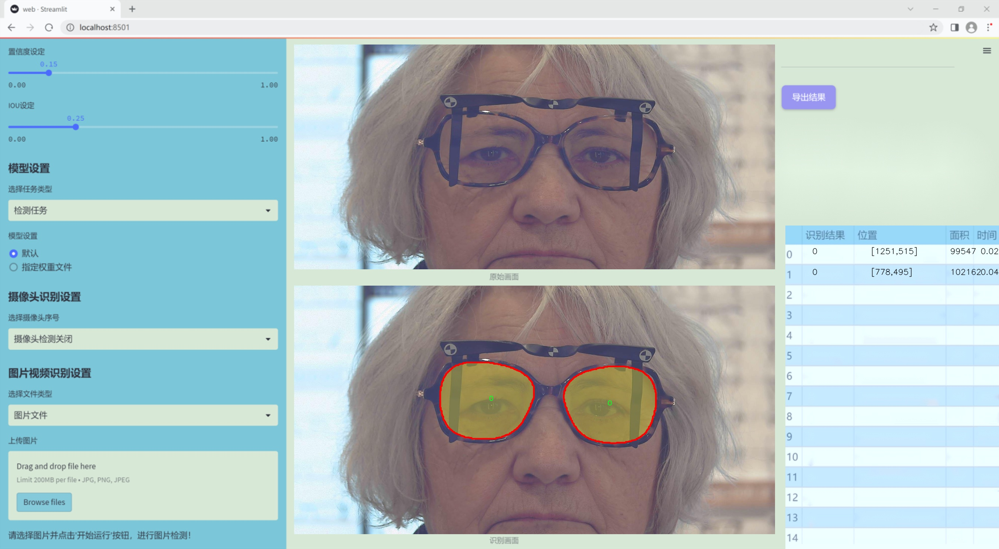
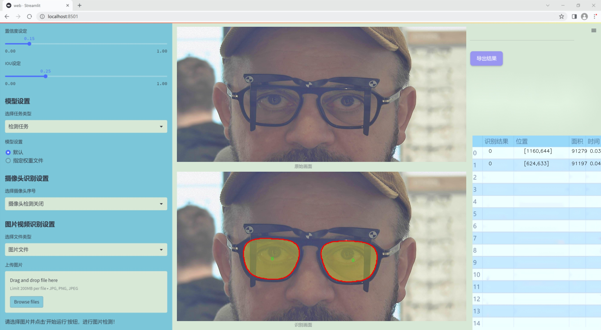
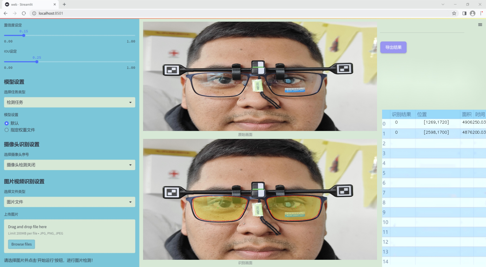
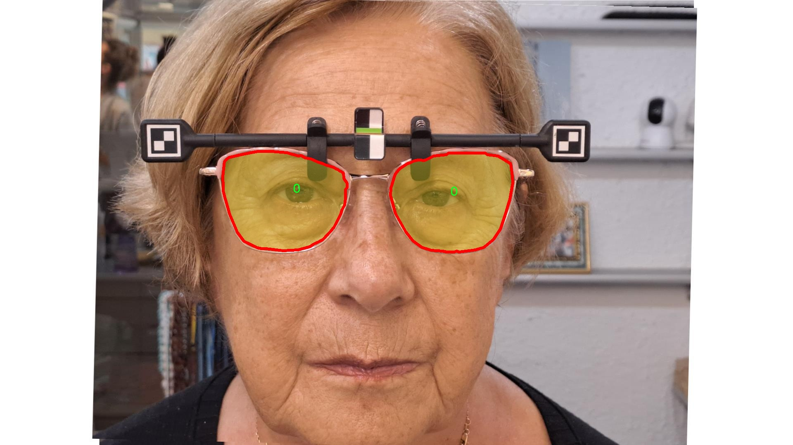
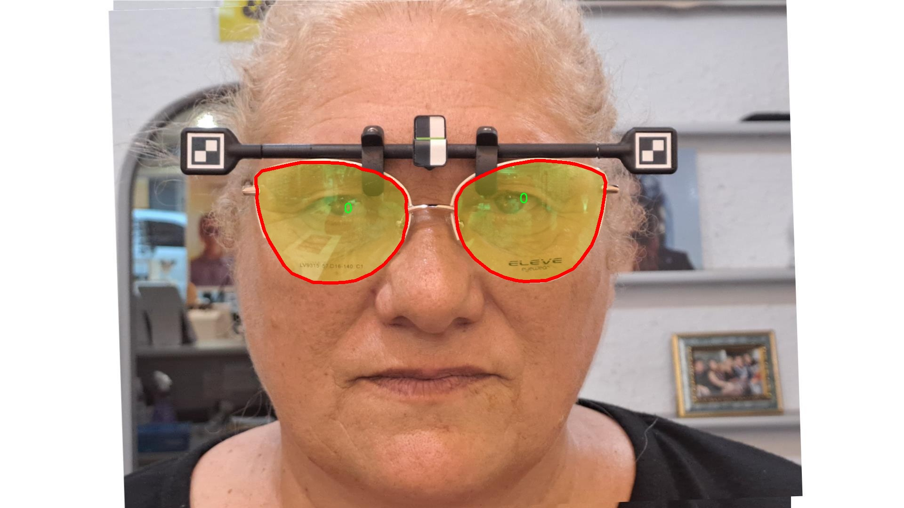
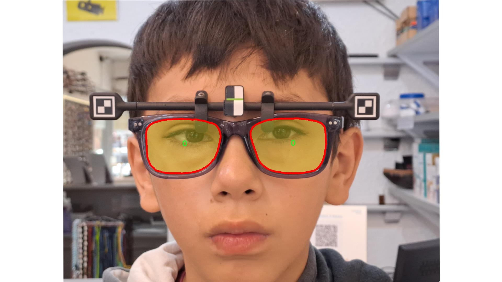
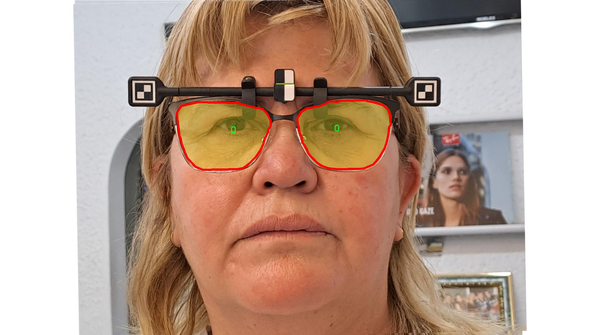
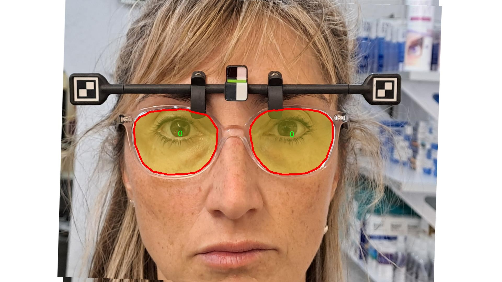

### 1.背景意义

研究背景与意义

随着计算机视觉技术的迅猛发展，实例分割作为其中一个重要的研究方向，受到了广泛关注。实例分割不仅要求模型能够识别图像中的物体，还需精确地划分出每个物体的轮廓，这在许多实际应用中具有重要意义。眼镜片的实例分割作为一个特定的应用场景，尤其在眼镜制造、视觉检测和智能零售等领域，展现出了巨大的潜力。通过对眼镜片进行精准的实例分割，可以有效提升产品质量检测的自动化水平，减少人工干预，提高生产效率。

本研究基于改进的YOLOv11模型，旨在构建一个高效的眼镜片实例分割系统。YOLO（You Only Look Once）系列模型以其快速的检测速度和良好的精度，成为实例分割领域的热门选择。然而，现有的YOLO模型在处理复杂背景和小物体时仍存在一定的局限性。因此，通过对YOLOv11进行改进，结合特定的眼镜片数据集，可以进一步提升模型的分割精度和鲁棒性。

本研究所使用的数据集包含2200张图像，涵盖了两类目标，分别为“0”和“object”。这些图像经过精心标注，确保了训练数据的高质量。通过对该数据集的深入分析与处理，我们能够为模型的训练提供更为丰富和多样化的样本，从而提升其在实际应用中的表现。此外，数据集的构建与优化过程也为后续的研究提供了宝贵的经验，推动了眼镜片实例分割技术的进一步发展。

综上所述，本研究不仅为眼镜片实例分割提供了新的技术路径，也为相关领域的研究者提供了可借鉴的经验和方法，具有重要的学术价值和实际应用意义。

### 2.视频效果

[2.1 视频效果](https://www.bilibili.com/video/BV1YorfYPEbe/)

### 3.图片效果







##### [项目涉及的源码数据来源链接](https://kdocs.cn/l/cszuIiCKVNis)**

注意：本项目提供训练的数据集和训练教程,由于版本持续更新,暂不提供权重文件（best.pt）,请按照6.训练教程进行训练后实现上图演示的效果。

### 4.数据集信息

##### 4.1 本项目数据集类别数＆类别名

nc: 2
names: ['0', 'object']


该项目为【图像分割】数据集，请在【训练教程和Web端加载模型教程（第三步）】这一步的时候按照【图像分割】部分的教程来训练

##### 4.2 本项目数据集信息介绍

本项目数据集信息介绍

本项目旨在改进YOLOv11的眼镜片实例分割系统，所使用的数据集围绕“novar-ipd”主题构建，专注于眼镜片的检测与分割。该数据集包含两类主要对象，分别为“0”和“object”，其中“0”代表背景或非目标区域，而“object”则指代眼镜片本身。这种二分类设计为模型提供了清晰的目标识别框架，使其能够有效区分眼镜片与其他干扰元素，从而提升实例分割的准确性。

数据集的构建过程包括多种数据采集方式，确保了样本的多样性和代表性。样本来源于不同的光照条件、背景环境以及眼镜片的多种形状和颜色，旨在模拟实际应用中可能遇到的各种情况。这种多样性不仅增强了模型的鲁棒性，也提高了其在不同场景下的适应能力。此外，数据集中还包含了大量的标注信息，为每个眼镜片提供了精确的边界框和分割掩码，这对于训练深度学习模型至关重要。

在数据预处理阶段，针对眼镜片的特征进行了增强处理，包括旋转、缩放和颜色调整等，以进一步丰富数据集的样本量和多样性。这些处理不仅有助于模型学习到更为复杂的特征，还能有效防止过拟合现象的发生。

总之，本项目的数据集通过精心设计和多样化的样本选择，为改进YOLOv11的眼镜片实例分割系统提供了坚实的基础。随着数据集的不断完善和模型的优化，期望能够在眼镜片检测与分割领域取得显著的进展，推动相关技术的应用与发展。











### 5.全套项目环境部署视频教程（零基础手把手教学）

[5.1 所需软件PyCharm和Anaconda安装教程（第一步）](https://www.bilibili.com/video/BV1BoC1YCEKi/?spm_id_from=333.999.0.0&vd_source=bc9aec86d164b67a7004b996143742dc)


[5.2 安装Python虚拟环境创建和依赖库安装视频教程（第二步）](https://www.bilibili.com/video/BV1ZoC1YCEBw?spm_id_from=333.788.videopod.sections&vd_source=bc9aec86d164b67a7004b996143742dc)

### 6.改进YOLOv11训练教程和Web_UI前端加载模型教程（零基础手把手教学）

[6.1 改进YOLOv11训练教程和Web_UI前端加载模型教程（第三步）](https://www.bilibili.com/video/BV1BoC1YCEhR?spm_id_from=333.788.videopod.sections&vd_source=bc9aec86d164b67a7004b996143742dc)


按照上面的训练视频教程链接加载项目提供的数据集，运行train.py即可开始训练



     Epoch   gpu_mem       box       obj       cls    labels  img_size
     1/200     20.8G   0.01576   0.01955  0.007536        22      1280: 100%|██████████| 849/849 [14:42<00:00,  1.04s/it]
               Class     Images     Labels          P          R     mAP@.5 mAP@.5:.95: 100%|██████████| 213/213 [01:14<00:00,  2.87it/s]
                 all       3395      17314      0.994      0.957      0.0957      0.0843

     Epoch   gpu_mem       box       obj       cls    labels  img_size
     2/200     20.8G   0.01578   0.01923  0.007006        22      1280: 100%|██████████| 849/849 [14:44<00:00,  1.04s/it]
               Class     Images     Labels          P          R     mAP@.5 mAP@.5:.95: 100%|██████████| 213/213 [01:12<00:00,  2.95it/s]
                 all       3395      17314      0.996      0.956      0.0957      0.0845

     Epoch   gpu_mem       box       obj       cls    labels  img_size
     3/200     20.8G   0.01561    0.0191  0.006895        27      1280: 100%|██████████| 849/849 [10:56<00:00,  1.29it/s]
               Class     Images     Labels          P          R     mAP@.5 mAP@.5:.95: 100%|███████   | 187/213 [00:52<00:00,  4.04it/s]
                 all       3395      17314      0.996      0.957      0.0957      0.0845


###### [项目数据集下载链接](https://kdocs.cn/l/cszuIiCKVNis)

### 7.原始YOLOv11算法讲解


YOLO11 是 Ultralytics YOLO 系列的最新版本，结合了尖端的准确性、速度和效率，用于目标检测、分割、分类、定向边界框和姿态估计。与
YOLOv8 相比，它具有更少的参数和更好的结果，不难预见，YOLO11 在边缘设备上更高效、更快，将频繁出现在计算机视觉领域的最先进技术（SOTA）中。


**主要特点**

  * **增强的特征提取：**YOLO11 使用改进的主干和颈部架构来增强特征提取，以实现更精确的目标检测和复杂任务的性能。

  * **针对效率和速度优化：**精细的架构设计和优化的训练流程在保持准确性和性能之间最佳平衡的同时，提供更快的处理速度。

  * **更少的参数，更高的准确度：**YOLO11m 在 COCO 数据集上实现了比 YOLOv8m 更高的 mAP，参数减少了 22%，提高了计算效率，同时不牺牲准确度。

  * **跨环境的适应性：**YOLO11 可以无缝部署在边缘设备、云平台和配备 NVIDIA GPU 的系统上，确保最大的灵活性。

  * **支持广泛的任务范围：**YOLO11 支持各种计算机视觉任务，如目标检测、实例分割、图像分类、姿态估计和定向目标检测（OBB）。


### 8.200+种全套改进YOLOV11创新点原理讲解

#### 8.1 200+种全套改进YOLOV11创新点原理讲解大全

由于篇幅限制，每个创新点的具体原理讲解就不全部展开，具体见下列网址中的改进模块对应项目的技术原理博客网址【Blog】（创新点均为模块化搭建，原理适配YOLOv5~YOLOv11等各种版本）

[改进模块技术原理博客【Blog】网址链接](https://gitee.com/qunmasj/good)


#### 8.2 精选部分改进YOLOV11创新点原理讲解

###### 这里节选部分改进创新点展开原理讲解(完整的改进原理见上图和[改进模块技术原理博客链接](https://gitee.com/qunmasj/good)【如果此小节的图加载失败可以通过CSDN或者Github搜索该博客的标题访问原始博客，原始博客图片显示正常】

### RT-DETR骨干网络HGNetv2简介
#### RT-DETR横空出世
前几天被百度的RT-DETR刷屏，参考该博客提出的目标检测新范式对原始DETR的网络结构进行了调整和优化，以提高计算速度和减小模型大小。这包括使用更轻量级的基础网络和调整Transformer结构。并且，摒弃了nms处理的detr结构与传统的物体检测方法相比，不仅训练是端到端的，检测也能端到端，这意味着整个网络在训练过程中一起进行优化，推理过程不需要昂贵的后处理代价，这有助于提高模型的泛化能力和性能。


当然，人们对RT-DETR之所以产生浓厚的兴趣，我觉得大概率还是对YOLO系列审美疲劳了，就算是出到了YOLO10086，我还是只想用YOLOv11和YOLOv11的框架来魔改做业务。。

#### 初识HGNet
看到RT-DETR的性能指标，发现指标最好的两个模型backbone都是用的HGNetv2，毫无疑问，和当时的picodet一样，骨干都是使用百度自家的网络。初识HGNet的时候，当时是参加了第四届百度网盘图像处理大赛，文档图像方向识别专题赛道，简单来说，就是使用分类网络对一些文档截图或者图片进行方向角度分类。


当时的方案并没有那么快定型，通常是打榜过程发现哪个网络性能好就使用哪个网络做魔改，而且木有显卡，只能蹭Ai Studio的平台，不过v100一天8小时的实验时间有点短，这也注定了大模型用不了。 

流水的模型，铁打的炼丹人，最后发现HGNet-tiny各方面指标都很符合我们的预期，后面就一直围绕它魔改。当然，比赛打榜是目的，学习才是享受过程，当时看到效果还可以，便开始折腾起了HGNet的网络架构，我们可以看到，PP-HGNet 针对 GPU 设备，对目前 GPU 友好的网络做了分析和归纳，尽可能多的使用 3x3 标准卷积（计算密度最高），PP-HGNet是由多个HG-Block组成，细节如下：


ConvBNAct是啥？简单聊一聊，就是Conv+BN+Act，CV Man应该最熟悉不过了：
```python
class ConvBNAct(TheseusLayer):
    def __init__(self,
                 in_channels,
                 out_channels,
                 kernel_size,
                 stride,
                 groups=1,
                 use_act=True):
        super().__init__()
        self.use_act = use_act
        self.conv = Conv2D(
            in_channels,
            out_channels,
            kernel_size,
            stride,
            padding=(kernel_size - 1) // 2,
            groups=groups,
            bias_attr=False)
        self.bn = BatchNorm2D(
            out_channels,
            weight_attr=ParamAttr(regularizer=L2Decay(0.0)),
            bias_attr=ParamAttr(regularizer=L2Decay(0.0)))
        if self.use_act:
            self.act = ReLU()
 
    def forward(self, x):
        x = self.conv(x)
        x = self.bn(x)
        if self.use_act:
            x = self.act(x)
        return x 
```
且标准卷积的数量随层数深度增加而增多，从而得到一个有利于 GPU 推理的骨干网络，同样速度下，精度也超越其他 CNN ，性价比也优于ViT-base模型。


另外，我们可以看到：

PP-HGNet 的第一层由channel为96的Stem模块构成，目的是为了减少参数量和计算量。PP-HGNet

Tiny的整体结构由四个HG Stage构成，而每个HG Stage主要由包含大量标准卷积的HG Block构成。

PP-HGNet的第三到第五层使用了使用了可学习的下采样层（LDS Layer），该层group为输入通道数，可达到降参降计算量的作用，且Tiny模型仅包含三个LDS Layer，并不会对GPU的利用率造成较大影响.

PP-HGNet的激活函数为Relu，常数级操作可保证该模型在硬件上的推理速度。

### 9.系统功能展示

图9.1.系统支持检测结果表格显示

  图9.2.系统支持置信度和IOU阈值手动调节

  图9.3.系统支持自定义加载权重文件best.pt(需要你通过步骤5中训练获得)

  图9.4.系统支持摄像头实时识别

  图9.5.系统支持图片识别

  图9.6.系统支持视频识别

  图9.7.系统支持识别结果文件自动保存

  图9.8.系统支持Excel导出检测结果数据


### 10. YOLOv11核心改进源码讲解

#### 10.1 kernel_warehouse.py

以下是对代码的核心部分进行的分析和详细注释：

```python
import torch
import torch.nn as nn
import torch.nn.functional as F
import collections.abc
from itertools import repeat

# 定义一个函数，用于解析输入参数并返回一个列表
def parse(x, n):
    if isinstance(x, collections.abc.Iterable):
        if len(x) == 1:
            return list(repeat(x[0], n))  # 如果x的长度为1，重复n次
        elif len(x) == n:
            return x  # 如果x的长度等于n，直接返回x
        else:
            raise ValueError('length of x should be 1 or n')  # 否则抛出异常
    else:
        return list(repeat(x, n))  # 如果x不是可迭代对象，重复x n次

# 定义注意力机制类
class Attention(nn.Module):
    def __init__(self, in_planes, reduction, num_static_cell, num_local_mixture, norm_layer=nn.BatchNorm1d,
                 cell_num_ratio=1.0, nonlocal_basis_ratio=1.0, start_cell_idx=None):
        super(Attention, self).__init__()
        hidden_planes = max(int(in_planes * reduction), 16)  # 计算隐藏层的通道数
        self.kw_planes_per_mixture = num_static_cell + 1  # 每个混合的通道数
        self.num_local_mixture = num_local_mixture  # 本地混合数
        self.kw_planes = self.kw_planes_per_mixture * num_local_mixture  # 总通道数

        # 计算本地和非本地单元的数量
        self.num_local_cell = int(cell_num_ratio * num_local_mixture)
        self.num_nonlocal_cell = num_static_cell - self.num_local_cell
        self.start_cell_idx = start_cell_idx

        # 定义层
        self.avgpool = nn.AdaptiveAvgPool1d(1)  # 自适应平均池化
        self.fc1 = nn.Linear(in_planes, hidden_planes, bias=(norm_layer is not nn.BatchNorm1d))  # 线性层
        self.norm1 = norm_layer(hidden_planes)  # 归一化层
        self.act1 = nn.ReLU(inplace=True)  # 激活函数

        # 根据非本地基数比率定义映射层
        if nonlocal_basis_ratio >= 1.0:
            self.map_to_cell = nn.Identity()  # 如果比率大于等于1，直接使用恒等映射
            self.fc2 = nn.Linear(hidden_planes, self.kw_planes, bias=True)  # 线性层
        else:
            self.map_to_cell = self.map_to_cell_basis  # 否则使用自定义映射
            self.num_basis = max(int(self.num_nonlocal_cell * nonlocal_basis_ratio), 16)  # 计算基数
            self.fc2 = nn.Linear(hidden_planes, (self.num_local_cell + self.num_basis + 1) * num_local_mixture, bias=False)  # 线性层
            self.fc3 = nn.Linear(self.num_basis, self.num_nonlocal_cell, bias=False)  # 线性层
            self.basis_bias = nn.Parameter(torch.zeros([self.kw_planes]), requires_grad=True).float()  # 基数偏置

        self.temp_bias = torch.zeros([self.kw_planes], requires_grad=False).float()  # 温度偏置
        self.temp_value = 0  # 温度值
        self._initialize_weights()  # 初始化权重

    def _initialize_weights(self):
        # 初始化权重
        for m in self.modules():
            if isinstance(m, nn.Linear):
                nn.init.kaiming_normal_(m.weight, mode='fan_out', nonlinearity='relu')  # Kaiming初始化
                if m.bias is not None:
                    nn.init.constant_(m.bias, 0)  # 偏置初始化为0
            if isinstance(m, nn.BatchNorm1d):
                nn.init.constant_(m.weight, 1)  # 归一化层权重初始化为1
                nn.init.constant_(m.bias, 0)  # 偏置初始化为0

    def forward(self, x):
        # 前向传播
        x = self.avgpool(x.reshape(*x.shape[:2], -1)).squeeze(dim=-1)  # 平均池化
        x = self.act1(self.norm1(self.fc1(x)))  # 线性变换 -> 归一化 -> 激活
        x = self.map_to_cell(self.fc2(x)).reshape(-1, self.kw_planes)  # 映射到单元
        x = x / (torch.sum(torch.abs(x), dim=1).view(-1, 1) + 1e-3)  # 归一化
        x = (1.0 - self.temp_value) * x.reshape(-1, self.kw_planes) + self.temp_value * self.temp_bias.to(x.device).view(1, -1)  # 温度调整
        return x.reshape(-1, self.kw_planes_per_mixture)[:, :-1]  # 返回结果

# 定义卷积层类
class KWconvNd(nn.Module):
    def __init__(self, in_planes, out_planes, kernel_size, stride=1, padding=0, dilation=1, groups=1,
                 bias=False, warehouse_id=None, warehouse_manager=None):
        super(KWconvNd, self).__init__()
        self.in_planes = in_planes  # 输入通道数
        self.out_planes = out_planes  # 输出通道数
        self.kernel_size = parse(kernel_size, self.dimension)  # 解析卷积核大小
        self.stride = parse(stride, self.dimension)  # 解析步幅
        self.padding = parse(padding, self.dimension)  # 解析填充
        self.dilation = parse(dilation, self.dimension)  # 解析膨胀
        self.groups = groups  # 分组卷积
        self.bias = nn.Parameter(torch.zeros([self.out_planes]), requires_grad=True).float() if bias else None  # 偏置
        self.warehouse_id = warehouse_id  # 仓库ID
        self.warehouse_manager = [warehouse_manager]  # 仓库管理器

    def forward(self, x):
        # 前向传播
        kw_attention = self.attention(x).type(x.dtype)  # 获取注意力权重
        batch_size = x.shape[0]  # 批大小
        x = x.reshape(1, -1, *x.shape[2:])  # 重塑输入
        weight = self.warehouse_manager[0].take_cell(self.warehouse_id).reshape(self.cell_shape[0], -1).type(x.dtype)  # 获取权重
        aggregate_weight = torch.mm(kw_attention, weight)  # 加权
        aggregate_weight = aggregate_weight.reshape([batch_size, self.groups_spatial, self.groups_out_channel,
                                                     self.groups_in_channel, *self.cell_shape[1:]])  # 重塑加权
        output = self.func_conv(x, weight=aggregate_weight, bias=None, stride=self.stride, padding=self.padding,
                                dilation=self.dilation, groups=self.groups * batch_size)  # 卷积操作
        output = output.view(batch_size, self.out_planes, *output.shape[2:])  # 重塑输出
        if self.bias is not None:
            output = output + self.bias.reshape(1, -1, *([1]*self.dimension))  # 添加偏置
        return output  # 返回输出

# 定义卷积类的子类
class KWConv1d(KWconvNd):
    dimension = 1
    func_conv = F.conv1d  # 使用1D卷积

class KWConv2d(KWconvNd):
    dimension = 2
    func_conv = F.conv2d  # 使用2D卷积

class KWConv3d(KWconvNd):
    dimension = 3
    func_conv = F.conv3d  # 使用3D卷积

# 定义线性层类
class KWLinear(nn.Module):
    def __init__(self, *args, **kwargs):
        super(KWLinear, self).__init__()
        self.conv = KWConv1d(*args, **kwargs)  # 使用1D卷积

    def forward(self, x):
        shape = x.shape  # 获取输入形状
        x = self.conv(x.reshape(shape[0], -1, shape[-1]).transpose(1, 2))  # 进行卷积
        x = x.transpose(1, 2).reshape(*shape[:-1], -1)  # 重塑输出
        return x  # 返回输出

# 定义仓库管理器类
class Warehouse_Manager(nn.Module):
    def __init__(self, reduction=0.0625, cell_num_ratio=1, cell_inplane_ratio=1,
                 cell_outplane_ratio=1, sharing_range=(), nonlocal_basis_ratio=1,
                 norm_layer=nn.BatchNorm1d, spatial_partition=True):
        super(Warehouse_Manager, self).__init__()
        self.sharing_range = sharing_range  # 共享范围
        self.warehouse_list = {}  # 仓库列表
        self.reduction = reduction  # 降维比例
        self.spatial_partition = spatial_partition  # 空间分区
        self.cell_num_ratio = cell_num_ratio  # 单元数量比例
        self.cell_outplane_ratio = cell_outplane_ratio  # 输出通道比例
        self.cell_inplane_ratio = cell_inplane_ratio  # 输入通道比例
        self.norm_layer = norm_layer  # 归一化层
        self.nonlocal_basis_ratio = nonlocal_basis_ratio  # 非本地基数比例
        self.weights = nn.ParameterList()  # 权重列表

    def reserve(self, in_planes, out_planes, kernel_size=1, stride=1, padding=0, dilation=1, groups=1,
                bias=True, warehouse_name='default', enabled=True, layer_type='conv2d'):
        # 创建动态卷积层并记录其信息
        kw_mapping = {'conv1d': KWConv1d, 'conv2d': KWConv2d, 'conv3d': KWConv3d, 'linear': KWLinear}
        org_mapping = {'conv1d': nn.Conv1d, 'conv2d': nn.Conv2d, 'conv3d': nn.Conv3d, 'linear': nn.Linear}

        if not enabled:
            layer_type = org_mapping[layer_type]  # 如果未启用，使用原始卷积层
            return layer_type(in_planes, out_planes, kernel_size, stride=stride, padding=padding, dilation=dilation,
                              groups=groups, bias=bias)
        else:
            layer_type = kw_mapping[layer_type]  # 否则使用KW卷积层
            weight_shape = [out_planes, in_planes // groups, *parse(kernel_size, layer_type.dimension)]  # 权重形状

            if warehouse_name not in self.warehouse_list.keys():
                self.warehouse_list[warehouse_name] = []  # 初始化仓库
            self.warehouse_list[warehouse_name].append(weight_shape)  # 记录权重形状

            return layer_type(in_planes, out_planes, kernel_size, stride=stride, padding=padding,
                              dilation=dilation, groups=groups, bias=bias,
                              warehouse_id=int(list(self.warehouse_list.keys()).index(warehouse_name)),
                              warehouse_manager=self)  # 返回卷积层

    def store(self):
        # 存储仓库信息
        warehouse_names = list(self.warehouse_list.keys())
        for idx, warehouse_name in enumerate(self.warehouse_list.keys()):
            warehouse = self.warehouse_list[warehouse_name]
            dimension = len(warehouse[0]) - 2  # 计算维度

            # 计算最大公约数
            out_plane_gcd, in_plane_gcd, kernel_size = warehouse[0][0], warehouse[0][1], warehouse[0][2:]
            for layer in warehouse:
                out_plane_gcd = math.gcd(out_plane_gcd, layer[0])  # 输出通道最大公约数
                in_plane_gcd = math.gcd(in_plane_gcd, layer[1])  # 输入通道最大公约数

            cell_in_plane = max(int(in_plane_gcd * self.cell_inplane_ratio[idx]), 1)  # 计算输入单元通道数
            cell_out_plane = max(int(out_plane_gcd * self.cell_outplane_ratio[idx]), 1)  # 计算输出单元通道数
            cell_kernel_size = parse(1, dimension) if self.spatial_partition[idx] else kernel_size  # 计算卷积核大小

            # 计算每层的混合数
            num_total_mixtures = 0
            for layer in warehouse:
                groups_channel = int(layer[0] // cell_out_plane * layer[1] // cell_in_plane)  # 计算通道组数
                groups_spatial = 1
                for d in range(dimension):
                    groups_spatial = int(groups_spatial * layer[2 + d] // cell_kernel_size[d])  # 计算空间组数

                num_layer_mixtures = groups_spatial * groups_channel  # 计算层混合数
                num_total_mixtures += num_layer_mixtures  # 累加总混合数

            self.weights.append(nn.Parameter(torch.randn(
                max(int(num_total_mixtures * self.cell_num_ratio[idx]), 1),
                cell_out_plane, cell_in_plane, *cell_kernel_size), requires_grad=True))  # 存储权重

    def take_cell(self, warehouse_idx):
        return self.weights[warehouse_idx]  # 返回指定仓库的权重

# 定义KWConv类
class KWConv(nn.Module):
    def __init__(self, c1, c2, wm=None, wm_name=None, k=1, s=1, p=None, g=1, d=1, act=True) -> None:
        super().__init__()
        
        assert wm is not None, 'wm param must be class Warehouse_Manager.'  # 确保仓库管理器不为空
        assert wm_name is not None, 'wm_name param must not be None.'  # 确保仓库名称不为空
        
        self.conv = wm.reserve(c1, c2, k, s, autopad(k, p, d), d, g, False, wm_name)  # 预留卷积层
        self.bn = nn.BatchNorm2d(c2)  # 批归一化层
        self.act = nn.Identity() if not act else act  # 激活函数

    def forward(self, x):
        x = self.conv(x)  # 卷积操作
        x = self.bn(x)  # 批归一化
        x = self.act(x)  # 激活
        return x  # 返回输出

# 获取温度函数
def get_temperature(iteration, epoch, iter_per_epoch, temp_epoch=20, temp_init_value=30.0, temp_end=0.0):
    total_iter = iter_per_epoch * temp_epoch  # 总迭代次数
    current_iter = iter_per_epoch * epoch + iteration  # 当前迭代次数
    temperature = temp_end + max(0, (temp_init_value - temp_end) * ((total_iter - current_iter) / max(1.0, total_iter)))  # 计算温度
    return temperature  # 返回温度
```

### 代码核心部分总结
1. **Attention类**：实现了一个注意力机制，包含多个线性层和归一化层，能够根据输入动态调整权重。
2. **KWconvNd类**：定义了一个通用的卷积层，支持多维卷积操作，并结合了注意力机制。
3. **Warehouse_Manager类**：管理卷积层的权重仓库，支持动态创建和存储卷积层的权重信息。
4. **KWConv类**：结合了卷积层、批归一化和激活函数的复合层，简化了卷积操作的使用。

以上代码通过模块化设计，便于扩展和维护，适合用于深度学习模型的构建。

这个文件 `kernel_warehouse.py` 实现了一个名为“内核仓库”的深度学习模块，主要用于管理和优化卷积操作中的内核（权重）使用。文件中包含多个类和函数，下面对其进行逐一分析。

首先，文件导入了必要的 PyTorch 库，包括 `torch` 和 `torch.nn`，以及一些其他的工具库。接着，定义了一个 `parse` 函数，用于解析输入参数并确保其符合预期的格式。

接下来，定义了一个 `Attention` 类，该类继承自 `nn.Module`，实现了一个注意力机制。它的构造函数中包含多个参数，如输入通道数、缩减比例、静态单元数量等。该类的主要功能是通过线性变换和池化操作生成注意力权重，并在前向传播中根据这些权重对输入进行加权处理。

`KWconvNd` 类是一个通用的卷积层类，支持多维卷积（1D、2D、3D）。它的构造函数接受输入和输出通道数、卷积核大小、步幅、填充、扩张、分组等参数，并初始化相应的属性。`init_attention` 方法用于初始化注意力机制，而 `forward` 方法则实现了前向传播，计算卷积操作的输出。

随后，定义了 `KWConv1d`、`KWConv2d` 和 `KWConv3d` 类，分别用于一维、二维和三维卷积操作。这些类继承自 `KWconvNd`，并设置了相应的维度和卷积函数。

`KWLinear` 类实现了一个线性层，内部使用 `KWConv1d` 进行计算，主要用于处理一维输入。

`Warehouse_Manager` 类是内核仓库的管理器，负责管理多个卷积层的内核。它的构造函数接受多个参数，包括缩减比例、单元数量比例、共享范围等。该类的 `reserve` 方法用于创建动态卷积层而不分配权重，并记录其信息。`store` 方法则用于存储内核的形状和参数，`allocate` 方法用于分配内核并初始化权重。

最后，`KWConv` 类是一个封装了卷积操作的模块，结合了内核仓库和批归一化，提供了更高层次的接口。`get_temperature` 函数用于计算温度值，可能用于动态调整模型训练过程中的某些参数。

整体来看，这个文件实现了一个灵活的内核管理系统，旨在提高卷积神经网络的效率和可扩展性。通过注意力机制和内核共享，能够有效减少参数数量，同时保持模型的表现。

#### 10.2 starnet.py

以下是代码中最核心的部分，并附上详细的中文注释：

```python
import torch
import torch.nn as nn
from timm.models.layers import DropPath, trunc_normal_

# 定义卷积层和批归一化的组合类
class ConvBN(torch.nn.Sequential):
    def __init__(self, in_planes, out_planes, kernel_size=1, stride=1, padding=0, dilation=1, groups=1, with_bn=True):
        super().__init__()
        # 添加卷积层
        self.add_module('conv', torch.nn.Conv2d(in_planes, out_planes, kernel_size, stride, padding, dilation, groups))
        # 如果需要，添加批归一化层
        if with_bn:
            self.add_module('bn', torch.nn.BatchNorm2d(out_planes))
            # 初始化批归一化的权重和偏置
            torch.nn.init.constant_(self.bn.weight, 1)
            torch.nn.init.constant_(self.bn.bias, 0)

# 定义网络中的基本模块
class Block(nn.Module):
    def __init__(self, dim, mlp_ratio=3, drop_path=0.):
        super().__init__()
        # 深度可分离卷积
        self.dwconv = ConvBN(dim, dim, 7, 1, (7 - 1) // 2, groups=dim, with_bn=True)
        # 线性变换层
        self.f1 = ConvBN(dim, mlp_ratio * dim, 1, with_bn=False)
        self.f2 = ConvBN(dim, mlp_ratio * dim, 1, with_bn=False)
        self.g = ConvBN(mlp_ratio * dim, dim, 1, with_bn=True)
        self.dwconv2 = ConvBN(dim, dim, 7, 1, (7 - 1) // 2, groups=dim, with_bn=False)
        self.act = nn.ReLU6()  # 激活函数
        self.drop_path = DropPath(drop_path) if drop_path > 0. else nn.Identity()  # 随机深度

    def forward(self, x):
        input = x  # 保存输入
        x = self.dwconv(x)  # 深度可分离卷积
        x1, x2 = self.f1(x), self.f2(x)  # 线性变换
        x = self.act(x1) * x2  # 元素级乘法
        x = self.dwconv2(self.g(x))  # 再次卷积
        x = input + self.drop_path(x)  # 残差连接
        return x

# 定义StarNet模型
class StarNet(nn.Module):
    def __init__(self, base_dim=32, depths=[3, 3, 12, 5], mlp_ratio=4, drop_path_rate=0.0, num_classes=1000, **kwargs):
        super().__init__()
        self.num_classes = num_classes
        self.in_channel = 32
        # stem层
        self.stem = nn.Sequential(ConvBN(3, self.in_channel, kernel_size=3, stride=2, padding=1), nn.ReLU6())
        dpr = [x.item() for x in torch.linspace(0, drop_path_rate, sum(depths))]  # 随机深度
        # 构建各个阶段
        self.stages = nn.ModuleList()
        cur = 0
        for i_layer in range(len(depths)):
            embed_dim = base_dim * 2 ** i_layer  # 当前层的嵌入维度
            down_sampler = ConvBN(self.in_channel, embed_dim, 3, 2, 1)  # 下采样
            self.in_channel = embed_dim
            blocks = [Block(self.in_channel, mlp_ratio, dpr[cur + i]) for i in range(depths[i_layer])]  # 添加Block
            cur += depths[i_layer]
            self.stages.append(nn.Sequential(down_sampler, *blocks))  # 将下采样和Block组合

    def forward(self, x):
        features = []
        x = self.stem(x)  # 通过stem层
        features.append(x)
        for stage in self.stages:
            x = stage(x)  # 通过每个阶段
            features.append(x)
        return features  # 返回特征

# 定义不同规模的StarNet模型构造函数
def starnet_s1(pretrained=False, **kwargs):
    model = StarNet(24, [2, 2, 8, 3], **kwargs)
    return model

def starnet_s2(pretrained=False, **kwargs):
    model = StarNet(32, [1, 2, 6, 2], **kwargs)
    return model

def starnet_s3(pretrained=False, **kwargs):
    model = StarNet(32, [2, 2, 8, 4], **kwargs)
    return model

def starnet_s4(pretrained=False, **kwargs):
    model = StarNet(32, [3, 3, 12, 5], **kwargs)
    return model
```

### 代码核心部分说明：
1. **ConvBN类**：该类将卷积层和批归一化层组合在一起，方便构建网络的基本单元。
2. **Block类**：这是StarNet的基本构建块，包含深度可分离卷积、线性变换和元素级乘法的操作，采用残差连接。
3. **StarNet类**：这是整个网络的定义，包含多个Block的堆叠和下采样过程，最终输出特征。
4. **模型构造函数**：提供了不同规模的StarNet模型的构造函数，便于根据需求创建不同的网络实例。

这个程序文件实现了一个名为StarNet的神经网络模型，主要用于图像处理任务。StarNet的设计理念是尽量简化网络结构，以突出元素级乘法的关键贡献。文件中包含了模型的定义、不同规模的网络版本以及预训练模型的加载功能。

首先，文件引入了必要的库，包括PyTorch和一些用于构建网络层的模块。接着，定义了一个字典`model_urls`，用于存储不同版本StarNet的预训练模型下载链接。

接下来，定义了一个`ConvBN`类，该类继承自`torch.nn.Sequential`，用于构建带有卷积层和批归一化层的组合。构造函数中初始化了卷积层和可选的批归一化层，并对其权重和偏置进行了初始化。

然后，定义了一个`Block`类，表示StarNet中的基本构建块。每个Block包含深度可分离卷积、两个全连接层和一个ReLU6激活函数。Block的前向传播方法中，输入首先经过深度卷积，然后通过两个全连接层，最后将结果通过激活函数进行元素级乘法，并经过另一个深度卷积层和残差连接返回。

`StarNet`类是整个模型的核心，包含多个Block的堆叠。构造函数中定义了输入通道、stem层和多个阶段，每个阶段由下采样和多个Block组成。通过`torch.linspace`生成的随机深度值用于实现随机深度的功能。模型的权重初始化通过`_init_weights`方法进行，确保模型在训练开始时具有良好的初始状态。

在`StarNet`的前向传播方法中，输入数据依次经过stem层和各个阶段，最终返回特征图。

文件还定义了多个函数（如`starnet_s1`、`starnet_s2`等），用于创建不同规模的StarNet模型，并提供了加载预训练权重的功能。这些函数允许用户根据需求选择合适的模型规模，并可选择是否加载预训练的权重。

最后，文件中还定义了一些非常小的网络版本（如`starnet_s050`、`starnet_s100`、`starnet_s150`），以适应不同的应用场景和计算资源限制。整体而言，这个文件提供了一个灵活且易于扩展的框架，适合进行图像分类等任务的研究和应用。

#### 10.3 wtconv2d.py

以下是代码中最核心的部分，并附上详细的中文注释：

```python
import torch
import torch.nn as nn
import torch.nn.functional as F
from torch.autograd import Function
import pywt

def create_wavelet_filter(wave, in_size, out_size, type=torch.float):
    # 创建小波滤波器
    w = pywt.Wavelet(wave)  # 使用pywt库创建小波对象
    # 获取小波的高通和低通滤波器，并反转顺序
    dec_hi = torch.tensor(w.dec_hi[::-1], dtype=type)
    dec_lo = torch.tensor(w.dec_lo[::-1], dtype=type)
    
    # 生成分解滤波器
    dec_filters = torch.stack([
        dec_lo.unsqueeze(0) * dec_lo.unsqueeze(1),
        dec_lo.unsqueeze(0) * dec_hi.unsqueeze(1),
        dec_hi.unsqueeze(0) * dec_lo.unsqueeze(1),
        dec_hi.unsqueeze(0) * dec_hi.unsqueeze(1)
    ], dim=0)

    # 重复滤波器以适应输入通道数
    dec_filters = dec_filters[:, None].repeat(in_size, 1, 1, 1)

    # 获取重构滤波器
    rec_hi = torch.tensor(w.rec_hi[::-1], dtype=type).flip(dims=[0])
    rec_lo = torch.tensor(w.rec_lo[::-1], dtype=type).flip(dims=[0])
    rec_filters = torch.stack([
        rec_lo.unsqueeze(0) * rec_lo.unsqueeze(1),
        rec_lo.unsqueeze(0) * rec_hi.unsqueeze(1),
        rec_hi.unsqueeze(0) * rec_lo.unsqueeze(1),
        rec_hi.unsqueeze(0) * rec_hi.unsqueeze(1)
    ], dim=0)

    # 重复滤波器以适应输出通道数
    rec_filters = rec_filters[:, None].repeat(out_size, 1, 1, 1)

    return dec_filters, rec_filters

def wavelet_transform(x, filters):
    # 执行小波变换
    b, c, h, w = x.shape  # 获取输入的形状
    pad = (filters.shape[2] // 2 - 1, filters.shape[3] // 2 - 1)  # 计算填充
    # 使用小波滤波器进行卷积
    x = F.conv2d(x, filters.to(x.dtype).to(x.device), stride=2, groups=c, padding=pad)
    x = x.reshape(b, c, 4, h // 2, w // 2)  # 重塑输出形状
    return x

def inverse_wavelet_transform(x, filters):
    # 执行逆小波变换
    b, c, _, h_half, w_half = x.shape  # 获取输入的形状
    pad = (filters.shape[2] // 2 - 1, filters.shape[3] // 2 - 1)  # 计算填充
    x = x.reshape(b, c * 4, h_half, w_half)  # 重塑输入形状
    # 使用逆小波滤波器进行转置卷积
    x = F.conv_transpose2d(x, filters.to(x.dtype).to(x.device), stride=2, groups=c, padding=pad)
    return x

class WaveletTransform(Function):
    # 定义小波变换的自定义函数
    @staticmethod
    def forward(ctx, input, filters):
        ctx.filters = filters  # 保存滤波器以便反向传播使用
        with torch.no_grad():
            x = wavelet_transform(input, filters)  # 执行前向小波变换
        return x

    @staticmethod
    def backward(ctx, grad_output):
        grad = inverse_wavelet_transform(grad_output, ctx.filters)  # 执行逆小波变换以计算梯度
        return grad, None

class WTConv2d(nn.Module):
    # 定义小波卷积层
    def __init__(self, in_channels, out_channels, kernel_size=5, stride=1, bias=True, wt_levels=1, wt_type='db1'):
        super(WTConv2d, self).__init__()

        assert in_channels == out_channels  # 输入通道数必须等于输出通道数

        self.in_channels = in_channels
        self.wt_levels = wt_levels
        self.stride = stride

        # 创建小波滤波器
        self.wt_filter, self.iwt_filter = create_wavelet_filter(wt_type, in_channels, in_channels, torch.float)
        self.wt_filter = nn.Parameter(self.wt_filter, requires_grad=False)  # 不需要训练的小波滤波器
        self.iwt_filter = nn.Parameter(self.iwt_filter, requires_grad=False)  # 不需要训练的逆小波滤波器

        # 定义基础卷积层
        self.base_conv = nn.Conv2d(in_channels, in_channels, kernel_size, padding='same', stride=1, groups=in_channels, bias=bias)

    def forward(self, x):
        # 执行小波卷积的前向传播
        for i in range(self.wt_levels):
            x = self.wt_function(x)  # 应用小波变换
            # 进一步处理...
        
        x = self.base_conv(x)  # 应用基础卷积
        return x
```

### 代码说明：
1. **小波滤波器创建**：`create_wavelet_filter` 函数生成小波变换所需的分解和重构滤波器。
2. **小波变换和逆变换**：`wavelet_transform` 和 `inverse_wavelet_transform` 函数分别执行小波变换和逆小波变换。
3. **自定义函数**：`WaveletTransform` 类实现了小波变换的前向和反向传播逻辑。
4. **小波卷积层**：`WTConv2d` 类定义了一个卷积层，结合了小波变换的特性，并实现了前向传播逻辑。

这个程序文件 `wtconv2d.py` 实现了一个基于小波变换的二维卷积层，主要用于图像处理和特征提取。程序中使用了 PyTorch 框架，并结合了小波变换的概念，以便在卷积操作中引入多尺度特征。

首先，文件导入了必要的库，包括 PyTorch 的核心库、神经网络模块、功能模块，以及用于小波变换的 `pywt` 库。程序定义了一个 `create_wavelet_filter` 函数，该函数用于生成小波变换的滤波器，包括分解滤波器和重构滤波器。分解滤波器用于将输入信号分解为低频和高频成分，而重构滤波器则用于将这些成分合并回原始信号。

接下来，程序定义了 `wavelet_transform` 和 `inverse_wavelet_transform` 函数，分别用于执行小波变换和逆小波变换。这两个函数使用了 PyTorch 的卷积操作，支持在多个通道上进行处理，并且通过适当的填充确保输出尺寸与输入尺寸匹配。

然后，程序定义了两个类 `WaveletTransform` 和 `InverseWaveletTransform`，这两个类继承自 `Function`，用于实现小波变换和逆变换的前向和反向传播功能。在前向传播中，它们调用之前定义的变换函数，而在反向传播中则计算梯度。

`wavelet_transform_init` 和 `inverse_wavelet_transform_init` 函数用于初始化小波变换和逆变换的应用函数，返回一个可调用的函数，这样可以在后续的模型中方便地使用。

接下来，定义了 `WTConv2d` 类，这是整个程序的核心部分，继承自 `nn.Module`。在初始化方法中，类接收输入通道数、输出通道数、卷积核大小、步幅、偏置、以及小波变换的层数和类型等参数。通过调用 `create_wavelet_filter` 函数生成小波滤波器，并将其封装为可训练的参数。

在 `forward` 方法中，输入数据经过小波变换和卷积操作，逐层处理后再进行逆小波变换，最终输出经过处理的特征图。该方法还考虑了输入尺寸的偶数性，确保在进行小波变换时不会出现尺寸不匹配的问题。

最后，程序定义了一个 `_ScaleModule` 类，用于实现一个简单的缩放操作，允许对输入特征图进行加权和偏置调整。

整体而言，这个程序文件实现了一个灵活的卷积层，结合了小波变换的优势，能够在多尺度上提取特征，适用于图像处理和深度学习任务。

#### 10.4 mamba_yolo.py

以下是代码中最核心的部分，并附上详细的中文注释：

```python
import torch
import torch.nn as nn
from einops import rearrange

class LayerNorm2d(nn.Module):
    """二维层归一化类"""
    def __init__(self, normalized_shape, eps=1e-6, elementwise_affine=True):
        super().__init__()
        # 初始化层归一化
        self.norm = nn.LayerNorm(normalized_shape, eps, elementwise_affine)

    def forward(self, x):
        # 前向传播
        x = rearrange(x, 'b c h w -> b h w c').contiguous()  # 变换维度
        x = self.norm(x)  # 应用层归一化
        x = rearrange(x, 'b h w c -> b c h w').contiguous()  # 恢复维度
        return x

class CrossScan(torch.autograd.Function):
    """交叉扫描操作"""
    @staticmethod
    def forward(ctx, x: torch.Tensor):
        B, C, H, W = x.shape  # 获取输入张量的形状
        ctx.shape = (B, C, H, W)
        xs = x.new_empty((B, 4, C, H * W))  # 创建新的张量用于存储交叉扫描结果
        xs[:, 0] = x.flatten(2, 3)  # 将输入张量展平
        xs[:, 1] = x.transpose(dim0=2, dim1=3).flatten(2, 3)  # 转置并展平
        xs[:, 2:4] = torch.flip(xs[:, 0:2], dims=[-1])  # 反转前两个结果
        return xs

    @staticmethod
    def backward(ctx, ys: torch.Tensor):
        # 反向传播
        B, C, H, W = ctx.shape
        L = H * W
        ys = ys[:, 0:2] + ys[:, 2:4].flip(dims=[-1]).view(B, 2, -1, L)  # 计算梯度
        y = ys[:, 0] + ys[:, 1].view(B, -1, W, H).transpose(dim0=2, dim1=3).contiguous().view(B, -1, L)
        return y.view(B, -1, H, W)

class CrossMerge(torch.autograd.Function):
    """交叉合并操作"""
    @staticmethod
    def forward(ctx, ys: torch.Tensor):
        B, K, D, H, W = ys.shape
        ctx.shape = (H, W)
        ys = ys.view(B, K, D, -1)
        ys = ys[:, 0:2] + ys[:, 2:4].flip(dims=[-1]).view(B, 2, D, -1)
        y = ys[:, 0] + ys[:, 1].view(B, -1, W, H).transpose(dim0=2, dim1=3).contiguous().view(B, D, -1)
        return y

    @staticmethod
    def backward(ctx, x: torch.Tensor):
        # 反向传播
        H, W = ctx.shape
        B, C, L = x.shape
        xs = x.new_empty((B, 4, C, L))
        xs[:, 0] = x
        xs[:, 1] = x.view(B, C, H, W).transpose(dim0=2, dim1=3).flatten(2, 3)
        xs[:, 2:4] = torch.flip(xs[:, 0:2], dims=[-1])
        xs = xs.view(B, 4, C, H, W)
        return xs, None, None

class SS2D(nn.Module):
    """SS2D模块"""
    def __init__(self, d_model=96, d_state=16, ssm_ratio=2.0, act_layer=nn.SiLU, dropout=0.0):
        super().__init__()
        self.in_proj = nn.Conv2d(d_model, d_model * ssm_ratio, kernel_size=1)  # 输入投影
        self.act = act_layer()  # 激活函数
        self.out_proj = nn.Conv2d(d_model * ssm_ratio, d_model, kernel_size=1)  # 输出投影
        self.dropout = nn.Dropout(dropout) if dropout > 0. else nn.Identity()  # Dropout层

    def forward(self, x: torch.Tensor):
        x = self.in_proj(x)  # 输入投影
        x = self.act(x)  # 激活
        x = self.out_proj(x)  # 输出投影
        return self.dropout(x)  # 应用Dropout

class VSSBlock_YOLO(nn.Module):
    """VSSBlock_YOLO模块"""
    def __init__(self, in_channels: int, hidden_dim: int, drop_path: float = 0):
        super().__init__()
        self.proj_conv = nn.Conv2d(in_channels, hidden_dim, kernel_size=1)  # 投影卷积
        self.ss2d = SS2D(d_model=hidden_dim)  # SS2D模块
        self.drop_path = nn.Dropout(drop_path)  # DropPath层

    def forward(self, input: torch.Tensor):
        input = self.proj_conv(input)  # 投影
        x = self.ss2d(input)  # SS2D处理
        return self.drop_path(input + x)  # 返回经过DropPath处理的结果
```

### 代码核心部分说明：
1. **LayerNorm2d**: 实现了二维层归一化，用于标准化输入特征。
2. **CrossScan**: 实现了交叉扫描操作，能够将输入张量进行特定的展平和反转操作。
3. **CrossMerge**: 实现了交叉合并操作，将经过交叉扫描的结果进行合并。
4. **SS2D**: 实现了一个简单的模块，包含输入投影、激活和输出投影的操作。
5. **VSSBlock_YOLO**: 结合了投影卷积和SS2D模块，形成一个完整的块，用于处理输入特征并返回结果。

这些模块是构建更复杂模型的基础，提供了重要的特征处理和变换功能。

这个程序文件 `mamba_yolo.py` 是一个实现了 YOLO（You Only Look Once）目标检测模型的 PyTorch 代码。代码中包含了多个自定义的神经网络模块和功能，主要用于构建和训练深度学习模型。

首先，代码导入了一些必要的库，包括 PyTorch、数学函数、部分函数、类型提示等。然后，定义了一个 `LayerNorm2d` 类，它是一个二维层归一化模块，适用于图像数据。这个模块在前向传播中会调整输入张量的形状，以便进行归一化处理。

接下来，定义了一个 `autopad` 函数，用于自动计算卷积操作所需的填充，以确保输出形状与输入形状相同。之后，代码实现了多个自定义的 PyTorch 自动求导函数，如 `CrossScan` 和 `CrossMerge`，它们用于处理输入张量的交叉扫描和合并操作。

`SelectiveScanCore` 类是一个核心的选择性扫描功能，提供了前向和反向传播的实现，允许在特定条件下对输入进行选择性处理。`cross_selective_scan` 函数则是对选择性扫描的封装，支持多个参数以控制扫描的行为。

接下来的 `SS2D` 类是一个主要的神经网络模块，结合了选择性扫描和其他卷积操作。它的构造函数定义了输入和输出的维度、激活函数、卷积层等，并实现了前向传播的逻辑。这个模块使用了多个内部层来处理输入数据，并在前向传播中应用了不同的变换。

其他类如 `RGBlock`、`LSBlock`、`XSSBlock` 和 `VSSBlock_YOLO` 也分别实现了不同的功能模块，组合了卷积、激活、归一化和跳跃连接等操作，以增强模型的表达能力和训练效果。

`SimpleStem` 类是一个简单的特征提取模块，使用卷积层和激活函数来处理输入数据。`VisionClueMerge` 类则用于合并特征图，利用不同的采样策略来增强特征表示。

总体来说，这个文件实现了一个复杂的深度学习模型，结合了选择性扫描、卷积神经网络和多种特征处理方法，旨在提高目标检测的性能和效率。每个模块的设计都考虑到了深度学习中的常见技术，如归一化、激活函数、跳跃连接等，以便于在训练过程中更好地捕捉特征和信息。

### 11.完整训练+Web前端界面+200+种全套创新点源码、数据集获取


# [下载链接：https://mbd.pub/o/bread/Z5ybk59w](https://mbd.pub/o/bread/Z5ybk59w)